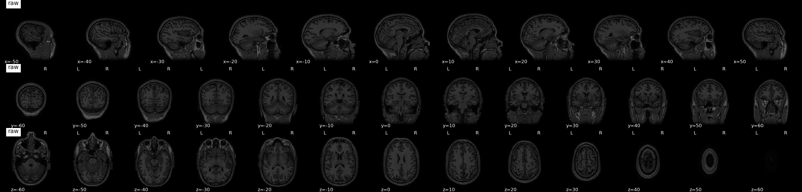

# compare_nii_gif

Create a gif that compares nifti files in axial, sagittal, and coronal views

## Install

```
pip install git+https://github.com/epongpipat/compare_nii_gif.git
```

## Usage
```
compare_nii_gif -i <in_path1> <in_path2> -o <out_path>
```

## Example
```
compare_nii_gif -i T1w_raw.nii.gz T1w_bet.nii.gz -o example.gif --titles raw bet
```


